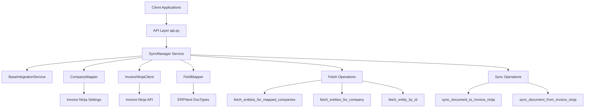
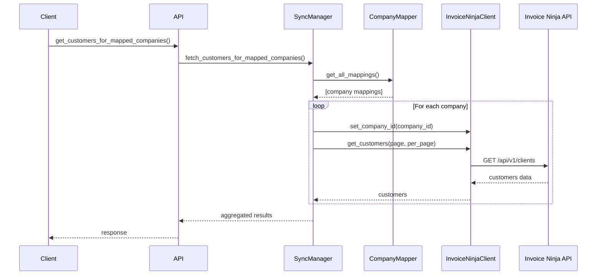
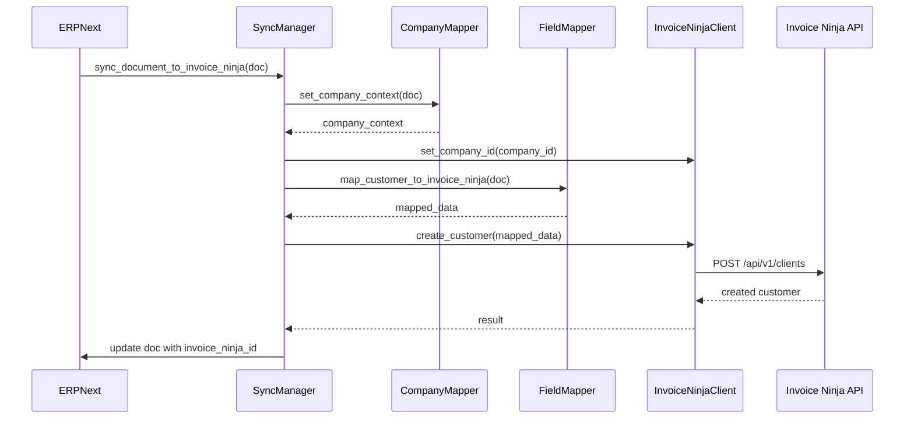
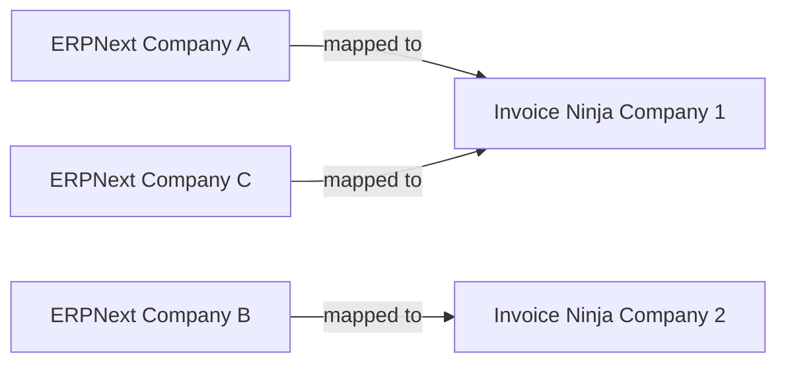

# Invoice Ninja Integration Architecture

## Overview

The Invoice Ninja Integration app follows a centralized service architecture pattern that provides a reusable foundation for building third-party integrations in Frappe/ERPNext. This document describes the architecture, design patterns, and how to extend or replicate this pattern for other integrations.

## Architecture Diagram



## Core Components

### 1. BaseIntegrationService (Abstract Base Class)

**Location**: `utils/base_integration_service.py`

The `BaseIntegrationService` is an abstract base class that defines the standard interface and patterns for all third-party integration services.

**Key Features**:
- Abstract methods that must be implemented by subclasses
- Standard validation and error handling
- Logging infrastructure
- Multi-company support patterns

**Usage Pattern**:
```python
from invoice_ninja_integration.utils.base_integration_service import BaseIntegrationService

class MyIntegrationService(BaseIntegrationService):
    SETTINGS_DOCTYPE = "My Integration Settings"
    ENTITY_CONFIG = {
        "Customer": {"endpoint": "customers", ...},
        # ... more entities
    }

    def _init_components(self):
        self.client = MyAPIClient()
        self.mapper = MyFieldMapper()
```

### 2. SyncManager (Concrete Implementation)

**Location**: `utils/sync_manager.py`

The `SyncManager` extends `BaseIntegrationService` with Invoice Ninja specific implementations.

**Responsibilities**:
- Manage bidirectional sync between Invoice Ninja and ERPNext
- Handle multi-company context
- Coordinate between client, mapper, and company mapper
- Provide generic and entity-specific fetch methods

**Key Methods**:

#### Generic Fetch Methods
```python
fetch_entities_for_mapped_companies(entity_type, page, per_page)
fetch_entities_for_company(entity_type, erpnext_company, invoice_ninja_company_id, page, per_page)
fetch_entity_by_id(entity_type, entity_id)
```

#### Entity-Specific Convenience Methods
```python
fetch_customers_for_mapped_companies(page, per_page)
fetch_invoices_for_mapped_companies(page, per_page)
fetch_quotations_for_mapped_companies(page, per_page)
fetch_items_for_mapped_companies(page, per_page)
fetch_payments_for_mapped_companies(page, per_page)
```

### 3. Entity Configuration

The `ENTITY_CONFIG` dictionary provides metadata for each supported entity type:

```python
ENTITY_CONFIG = {
    "Customer": {
        "invoice_ninja_endpoint": "clients",
        "invoice_ninja_method": "get_customers",
        "erpnext_doctype": "Customer",
        "include_params": "contacts,group_settings"
    },
    # ... more entities
}
```

This configuration-driven approach makes it easy to add new entity types without modifying core logic.

## Data Flow

### Fetch Operation Flow



### Sync Operation Flow



## API Layer

### Endpoint Structure

The API layer (`api.py`) provides whitelisted methods that can be called from client-side JavaScript or via REST API.

**Pattern**:
```python
@frappe.whitelist()
def get_customers_for_mapped_companies(page=1, per_page=100):
    """API endpoint that uses SyncManager internally"""
    sync_manager = SyncManager()
    result = sync_manager.fetch_customers_for_mapped_companies(page, per_page)

    # Transform result for backward compatibility
    # ... transformation logic ...

    return result
```

### Generic Endpoint

The `fetch_entities` endpoint provides a unified interface for all entity types:

```python
@frappe.whitelist()
def fetch_entities(entity_type, scope="all_companies", company_identifier=None, page=1, per_page=100):
    """
    Generic endpoint to fetch any entity type

    Examples:
        fetch_entities("Customer", "all_companies")
        fetch_entities("Sales Invoice", "single_company", "Company A")
    """
```

## Multi-Company Support

### Company Mapping

The `CompanyMapper` manages the relationship between ERPNext companies and Invoice Ninja companies:



**Key Methods**:
- `get_all_mappings()`: Get all enabled company mappings
- `get_company_mapping(erpnext_company, invoice_ninja_company_id)`: Get specific mapping
- `get_invoice_ninja_company_id(erpnext_company)`: Resolve Invoice Ninja company ID
- `get_erpnext_company(invoice_ninja_company_id)`: Resolve ERPNext company

### Company Context

When fetching or syncing data, the system automatically sets the correct company context:

```python
# Set company context on client
client.set_company_id(company_id)

# This adds X-API-COMPANY header to all subsequent requests
# Invoice Ninja API returns data only for that company
```

## Extending the Architecture

### Adding a New Entity Type

1. **Add to ENTITY_CONFIG**:
```python
ENTITY_CONFIG = {
    # ... existing entities ...
    "Expense": {
        "invoice_ninja_endpoint": "expenses",
        "invoice_ninja_method": "get_expenses",
        "erpnext_doctype": "Expense Claim",
        "include_params": "vendor,category"
    }
}
```

2. **Add convenience methods** (optional):
```python
def fetch_expenses_for_mapped_companies(self, page=1, per_page=100):
    return self.fetch_entities_for_mapped_companies("Expense", page, per_page)
```

3. **Add API endpoint** (optional):
```python
@frappe.whitelist()
def get_expenses_for_mapped_companies(page=1, per_page=100):
    sync_manager = SyncManager()
    return sync_manager.fetch_expenses_for_mapped_companies(page, per_page)
```

### Creating a New Integration App

Follow this pattern to create integrations for other services (Shopify, Stripe, QuickBooks, etc.):

#### Step 1: Create Service Class

```python
# shopify_integration/utils/shopify_service.py
from invoice_ninja_integration.utils.base_integration_service import BaseIntegrationService

class ShopifyIntegrationService(BaseIntegrationService):
    SETTINGS_DOCTYPE = "Shopify Settings"

    ENTITY_CONFIG = {
        "Customer": {
            "shopify_endpoint": "customers",
            "shopify_method": "get_customers",
            "erpnext_doctype": "Customer",
            "include_params": "addresses,orders"
        },
        "Sales Order": {
            "shopify_endpoint": "orders",
            "shopify_method": "get_orders",
            "erpnext_doctype": "Sales Order",
            "include_params": "line_items,customer"
        }
    }

    def _init_components(self):
        self.client = ShopifyClient()
        self.mapper = ShopifyFieldMapper()
        self.company_mapper = ShopifyCompanyMapper()

    def fetch_entities_for_mapped_companies(self, entity_type, page=1, per_page=100, filters=None):
        # Implementation similar to SyncManager
        # ... fetch logic ...
        pass

    def fetch_entities_for_company(self, entity_type, erpnext_company=None,
                                   shopify_company_id=None, page=1, per_page=100, filters=None):
        # Implementation for single company
        # ... fetch logic ...
        pass

    def fetch_entity_by_id(self, entity_type, entity_id, erpnext_company=None,
                          shopify_company_id=None):
        # Implementation for single entity
        # ... fetch logic ...
        pass
```

#### Step 2: Create API Layer

```python
# shopify_integration/api.py
import frappe
from .utils.shopify_service import ShopifyIntegrationService

@frappe.whitelist()
def get_customers_for_mapped_companies(page=1, per_page=100):
    service = ShopifyIntegrationService()
    return service.fetch_customers_for_mapped_companies(page, per_page)

@frappe.whitelist()
def fetch_entities(entity_type, scope="all_companies", company_identifier=None, page=1, per_page=100):
    service = ShopifyIntegrationService()
    # ... implementation ...
```

#### Step 3: Create Supporting Components

- **Client**: API communication layer
- **FieldMapper**: Data transformation between systems
- **CompanyMapper**: Multi-company mapping logic
- **Settings DocType**: Configuration interface

## Design Patterns Used

### 1. Template Method Pattern

`BaseIntegrationService` defines the template, subclasses implement specific steps:
```python
class BaseIntegrationService(ABC):
    @abstractmethod
    def _init_components(self):
        pass  # Subclass implements
```

### 2. Strategy Pattern

Different entity types use different fetch strategies, configured via `ENTITY_CONFIG`.

### 3. Facade Pattern

`SyncManager` provides a simplified interface to complex subsystems (client, mapper, company mapper).

### 4. Factory Pattern

Entity-specific methods act as factories for generic operations:
```python
def fetch_customers_for_mapped_companies(self, page=1, per_page=100):
    return self.fetch_entities_for_mapped_companies("Customer", page, per_page)
```

## Benefits of This Architecture

1. **Single Source of Truth**: All data operations go through SyncManager
2. **Consistency**: Same patterns for all entity types
3. **Maintainability**: Changes in one place affect all entities
4. **Testability**: Easy to mock and test individual components
5. **Reusability**: Base pattern can be used for any integration
6. **Scalability**: Easy to add new entities via configuration
7. **Company-Aware**: Multi-company support built into core
8. **Extensibility**: Clear extension points for customization

## Performance Considerations

### Pagination

All fetch methods support pagination to handle large datasets:
```python
# Fetch first page
page_1 = sync_manager.fetch_customers_for_mapped_companies(page=1, per_page=50)

# Fetch next page
page_2 = sync_manager.fetch_customers_for_mapped_companies(page=2, per_page=50)
```

### Caching

Consider implementing caching for frequently accessed data:
```python
@frappe.cache()
def get_company_mappings():
    # Cached for performance
    pass
```

### Batch Operations

For bulk operations, process in batches:
```python
def sync_all_customers_in_batches(batch_size=100):
    page = 1
    while True:
        result = sync_manager.fetch_customers_for_mapped_companies(page=page, per_page=batch_size)
        if not result.get("companies") or result["total_entities"] == 0:
            break

        # Process batch
        process_customers(result)
        page += 1
```

## Error Handling

### Validation Errors

```python
# Entity type validation
is_valid, error_msg = sync_manager.validate_entity_type("InvalidType")
if not is_valid:
    return {"success": False, "message": error_msg}
```

### API Errors

```python
try:
    result = client.get_customers()
except APIConnectionError as e:
    frappe.log_error(str(e), "API Connection Error")
    return {"success": False, "message": "Connection failed"}
```

### Logging

```python
# Success logging
sync_manager.log_sync_success(doc, "ERPNext to Invoice Ninja", "Customer synced successfully")

# Error logging
sync_manager.log_sync_error(doc, "ERPNext to Invoice Ninja", str(error))
```

## Testing

### Unit Tests

Test individual components:
```python
def test_company_mapper():
    mapper = CompanyMapper()
    mapping = mapper.get_company_mapping(erpnext_company="Company A")
    assert mapping is not None
```

### Integration Tests

Test end-to-end flows:
```python
def test_fetch_customers_integration():
    sync_manager = SyncManager()
    result = sync_manager.fetch_customers_for_mapped_companies(per_page=5)
    assert result["success"] == True
```

### Test Script

Run comprehensive tests:
```bash
bench --site [site-name] execute invoice_ninja_integration.test_customer_fetch.test_fetch_customers
```

## Future Enhancements

### Planned Features

1. **Webhook Support**: Real-time updates from Invoice Ninja
2. **Conflict Resolution**: Handle sync conflicts intelligently
3. **Audit Trail**: Track all sync operations
4. **Retry Mechanism**: Automatic retry for failed operations
5. **Rate Limiting**: Respect API rate limits
6. **Bulk Operations**: Optimize for large-scale syncs

### Extension Points

- Custom field mappings
- Pre/post sync hooks
- Custom validation rules
- Alternative storage backends
- Custom logging strategies

## Conclusion

This architecture provides a robust, scalable, and reusable foundation for building third-party integrations in Frappe/ERPNext. By following these patterns, developers can quickly create new integrations while maintaining consistency and code quality across the ecosystem.

## Related Documentation

- [README.md](README.md) - General overview and installation
- [COMPANY_MAPPING.md](COMPANY_MAPPING.md) - Company mapping feature
- [CUSTOMER_FETCH_API.md](CUSTOMER_FETCH_API.md) - API documentation
- [QUICK_START_CUSTOMER_FETCH.md](QUICK_START_CUSTOMER_FETCH.md) - Quick start guide

## Support

For questions or issues:
- Check Error Log in ERPNext
- Review Invoice Ninja Sync Logs
- Consult this architecture documentation
- Create an issue on GitHub

